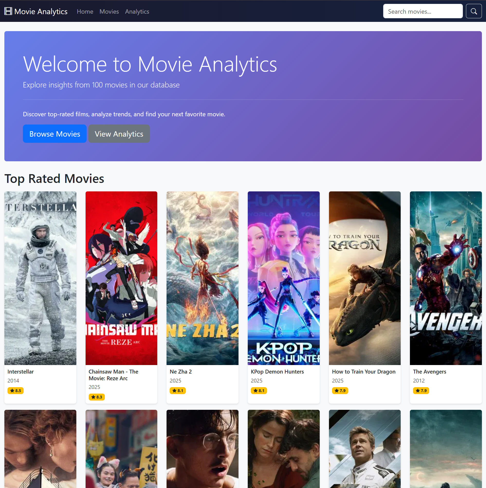

# Movie Analytics Dashboard


A full-stack web application for exploring and analyzing movie data using Flask, SQLAlchemy, and the TMDB API. This project demonstrates Python, SQL, web development, and data visualization skills.



## Features

- **Browse Movies**: Explore 1,000+ popular movies with poster images and full pagination controls
- **Advanced Filtering**: Filter movies by year, decade, rating range, and runtime
- **Detailed Movie Pages**: Stunning backdrop banners with comprehensive information including cast, crew, ratings, budget, revenue, and YouTube trailers
- **Financial Analysis**: View detailed budget, revenue, and ROI calculations with visual profit/loss indicators
- **Top Actors**: Browse the most frequently appearing actors with filmography pages
- **Hidden Gems**: Discover highly-rated, low-popularity movies using a gem score algorithm
- **Smart Search**: Search movies by title or description with helpful "no results" messaging
- **Sort & Filter**: Sort by popularity, rating, release date, or title with genre filtering
- **Intelligent Recommendations**: Similar movies section sorted by genre match, rating, and popularity
- **Analytics Dashboard**: Interactive visualizations with Chart.js including:
  - Genre distribution (pie chart)
  - Movies released by year (bar chart)
  - Average ratings by genre (horizontal bar chart)
  - Budget vs. revenue analysis
  - Top production companies
- **Dark Mode**: Toggle between light and dark themes for comfortable viewing
- **Movie Trailers**: Watch official YouTube trailers directly on movie detail pages
- **Responsive Pagination**: Navigate large datasets with first/previous/next/last controls

## Tech Stack

- **Backend**: Python, Flask
- **Database**: SQLite with SQLAlchemy ORM
- **API**: The Movie Database (TMDB) API
- **Frontend**: HTML, CSS, Bootstrap 5, Chart.js
- **Version Control**: Git

## Database Schema

The application uses a normalized relational database with the following tables:

- `movies` - Core movie information (including backdrop_path for banner images)
- `genres` - Movie genres
- `movie_genres` - Many-to-many relationship between movies and genres
- `people` - Actors, directors, and crew members
- `cast` - Movie cast information
- `crew` - Movie crew information
- `production_companies` - Production company details
- `movie_companies` - Many-to-many relationship between movies and companies

## Project Structure
```
movie-analytics-dashboard/
├── config/
│   ├── .env                 # Environment variables (API keys)
│   └── config.py           # Application configuration
├── database/
│   ├── schema.sql          # Database schema
│   └── migrations/         # Database migrations
├── src/
│   ├── models.py           # SQLAlchemy models
│   ├── tmdb_api.py         # TMDB API client
│   ├── data_import.py      # Data import scripts
│   └── app.py              # Flask application
├── templates/              # HTML templates
├── static/
│   ├── css/               # Stylesheets
│   ├── js/                # JavaScript files
│   └── images/            # Images
├── docs/                  # Documentation and screenshots
├── tests/                 # Unit tests
├── .gitignore
├── requirements.txt       # Python dependencies
└── README.md
```

## Installation & Setup

### Prerequisites

- Python 3.8+
- pip
- Git

### Steps

1. **Clone the repository**
```bash
   git clone https://github.com/jaime-builds/movie-analytics-dashboard.git
   cd movie-analytics-dashboard
```

2. **Create and activate virtual environment**
```bash
   python -m venv venv

   # On Windows
   .\venv\Scripts\activate

   # On macOS/Linux
   source venv/bin/activate
```

3. **Install dependencies**
```bash
   pip install -r requirements.txt
```

4. **Get TMDB API Key**
   - Sign up at [themoviedb.org](https://www.themoviedb.org/)
   - Go to Settings → API → Request API Key
   - Choose "Developer" and fill out the form
   - Copy your API Key (v3 auth)

5. **Configure environment variables**

   Create `config/.env`:
```
   TMDB_API_KEY=your_api_key_here
   DATABASE_URL=sqlite:///movies.db
```

6. **Initialize database**
```bash
   python -m src.models
```

7. **Import movie data**
```bash
   python -m src.data_import
```
   This will import 1,000 popular movies with cast, crew, metadata, and backdrop images (takes 5-10 minutes).

8. **Run the application**
```bash
   python -m src.app
```

   Open your browser to: `http://127.0.0.1:5000`

## Key Features

### Cinematic Movie Detail Pages
Each movie features:
- **Backdrop Banner**: Full-width backdrop image with gradient overlay and movie title
- **Financial Details**: Comprehensive budget, revenue, profit/loss, and ROI analysis
- **Visual ROI Indicator**: Progress bar showing return on investment
- **Smart Recommendations**: Similar movies sorted by shared genres and ratings
- **Complete Cast & Crew**: Top actors with character names and directors

### Advanced Movie Filtering
Filter movies by multiple criteria simultaneously:
- **Year**: Specific release year
- **Decade**: Browse movies by decade (1920s-2020s)
- **Rating Range**: Minimum and maximum rating thresholds
- **Runtime**: Filter by movie length in minutes
- **Genre**: Single genre selection
- All filters work with sorting and pagination

### Enhanced Pagination
Navigate large movie collections with ease:
- First/Previous/Next/Last page buttons
- Direct page number selection
- Page ellipsis for large page counts
- Filter preservation across page navigation
- Shows current position (e.g., "Showing 1-20 of 1,000 movies")

### Intelligent Search
Search for movies with helpful features:
- Search by title or description
- Results sorted by popularity
- Friendly "no results found" message with search tips
- Quick links to browse all movies or discover hidden gems

### Top Actors Page
Browse the most prolific actors in the database:
- Ranked by number of movie appearances
- Sort by movie count, average rating, popularity, or name
- Click any actor to view their complete filmography
- See character names and roles for each movie
- View actor biography, birthplace, and career statistics

### Hidden Gems Discovery
Find underrated masterpieces using a smart discovery algorithm:
- **Gem Score Formula**: Balances high ratings with low popularity
- Adjustable thresholds for what counts as "hidden"
- Filter by genre and decade
- Sort by gem score, rating, obscurity, or release date
- Perfect for discovering overlooked indie films and foreign cinema

### Analytics Dashboard
Interactive data visualizations powered by Chart.js:
- Genre distribution across your movie collection
- Release trends over time
- Average ratings by genre
- Budget vs. revenue profitability analysis
- Top production companies by movie count

## SQL Queries Showcase

This project demonstrates various SQL concepts:

- **Complex JOINs**: Multi-table queries joining movies, genres, cast, and crew
- **Aggregations**: GROUP BY, COUNT, AVG for analytics
- **Window Functions**: Ranking and statistical analysis
- **Subqueries**: Finding similar movies based on genre overlap with match counting
- **Indexes**: Performance optimization on frequently queried columns
- **Many-to-Many Relationships**: Junction tables for movies-genres and movies-companies

Example query from the Top Actors page:
```sql
SELECT
    p.id,
    p.name,
    COUNT(c.movie_id) as movie_count,
    AVG(m.vote_average) as avg_rating
FROM people p
JOIN cast c ON p.id = c.person_id
JOIN movies m ON c.movie_id = m.id
WHERE m.vote_count > 20
GROUP BY p.id, p.name
HAVING COUNT(c.movie_id) >= 2
ORDER BY movie_count DESC;
```

Example query for Hidden Gems:
```sql
SELECT *
FROM movies
WHERE vote_average >= 7.0
  AND popularity <= 20.0
  AND vote_count >= 50
ORDER BY (vote_average / LOG(popularity + 2)) DESC;
```

Advanced query for similar movies (sorted by genre match):
```sql
SELECT m.*, COUNT(mg.genre_id) as match_count
FROM movies m
JOIN movie_genres mg ON m.id = mg.movie_id
WHERE mg.genre_id IN (SELECT genre_id FROM movie_genres WHERE movie_id = ?)
  AND m.id != ?
GROUP BY m.id
ORDER BY match_count DESC, m.vote_average DESC, m.popularity DESC
LIMIT 6;
```

## Key Skills Demonstrated

### Python Skills
- Object-oriented programming with SQLAlchemy models
- API integration and data parsing (TMDB API)
- Complex query building with SQLAlchemy ORM including subqueries
- Data aggregation and statistical analysis
- Error handling and data validation
- Virtual environments and dependency management
- Advanced SQLAlchemy queries with CTEs and window functions

### SQL Skills
- Database schema design with normalization
- Complex queries with multiple JOINs and subqueries
- Aggregate functions (COUNT, AVG, SUM) with GROUP BY
- HAVING clauses for filtered aggregations
- Many-to-many relationships via junction tables
- Query optimization with indexes
- Advanced sorting with multiple criteria

### Web Development
- RESTful routing with Flask
- Template inheritance with Jinja2
- Responsive design with Bootstrap 5
- Interactive data visualization with Chart.js
- Client-side state management (dark mode with localStorage)
- Dynamic filtering with URL parameters
- Pagination for large datasets with filter preservation
- YouTube embed integration
- Progressive enhancement for user experience

### Git & Version Control
- Feature branch workflow
- Meaningful commit messages
- Proper .gitignore configuration
- Remote repository management

## Analytics Visualizations

The analytics dashboard features interactive Chart.js visualizations:

- **Genre Distribution Pie Chart**: Visual breakdown of movies by genre
- **Movies by Year Bar Chart**: Timeline of movie releases
- **Average Ratings by Genre**: Horizontal bar chart showing which genres rate highest
- **Budget vs Revenue Analysis**: Compare production costs to box office performance
- **Top Production Companies**: Bar chart of most prolific studios

All charts are fully responsive and adapt to dark mode for optimal viewing.


## Recent Updates

### Latest Features (February 2026)
- ✨ **Backdrop Banners**: Cinematic full-width backdrop images on movie detail pages
- 💰 **Financial Analysis**: Detailed budget, revenue, profit/loss, and ROI calculations
- 🔍 **Smart Search**: Enhanced search with "no results found" messaging and helpful tips
- 📄 **Advanced Pagination**: Full pagination controls with first/last/numbered pages
- 🎬 **Intelligent Recommendations**: Similar movies sorted by genre match and ratings

## Future Enhancements

- [ ] User authentication and personalized recommendations
- [ ] Movie ratings and reviews system
- [ ] Favorites/watchlist system
- [ ] Director Spotlight page with filmographies
- [ ] Export analytics reports as PDF/CSV
- [ ] RESTful API endpoints
- [ ] PostgreSQL migration for production
- [ ] Docker containerization
- [ ] Deployment to cloud platform

## Contributing

Contributions are welcome! Please feel free to submit a Pull Request.

## License

This project is open source and available under the [MIT License](LICENSE).

## Acknowledgments

- Movie data provided by [The Movie Database (TMDB)](https://www.themoviedb.org/)
- Bootstrap for UI components
- Chart.js for data visualization

## Contact

**Jaime De La Paz**
- GitHub: [@jaime-builds](https://github.com/jaime-builds)
- Project Link: [https://github.com/jaime-builds/movie-analytics-dashboard](https://github.com/jaime-builds/movie-analytics-dashboard)

---

*This project was created as a portfolio piece to demonstrate full-stack development skills with Python, SQL, and web technologies.*
