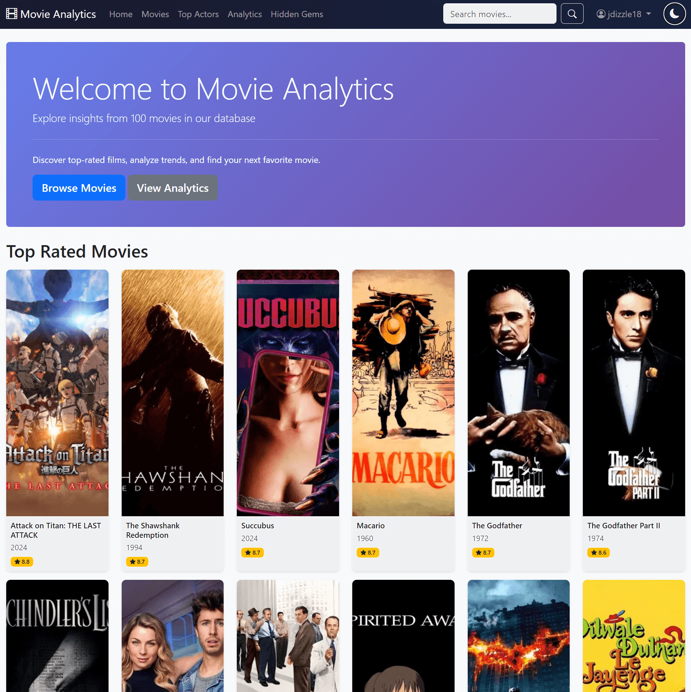
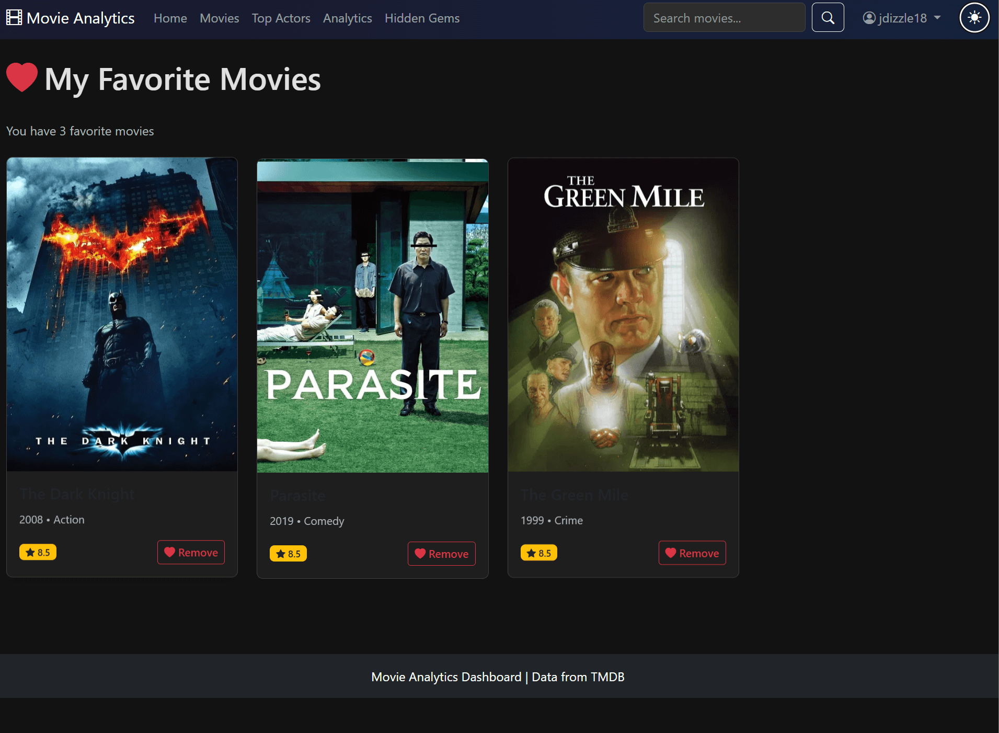
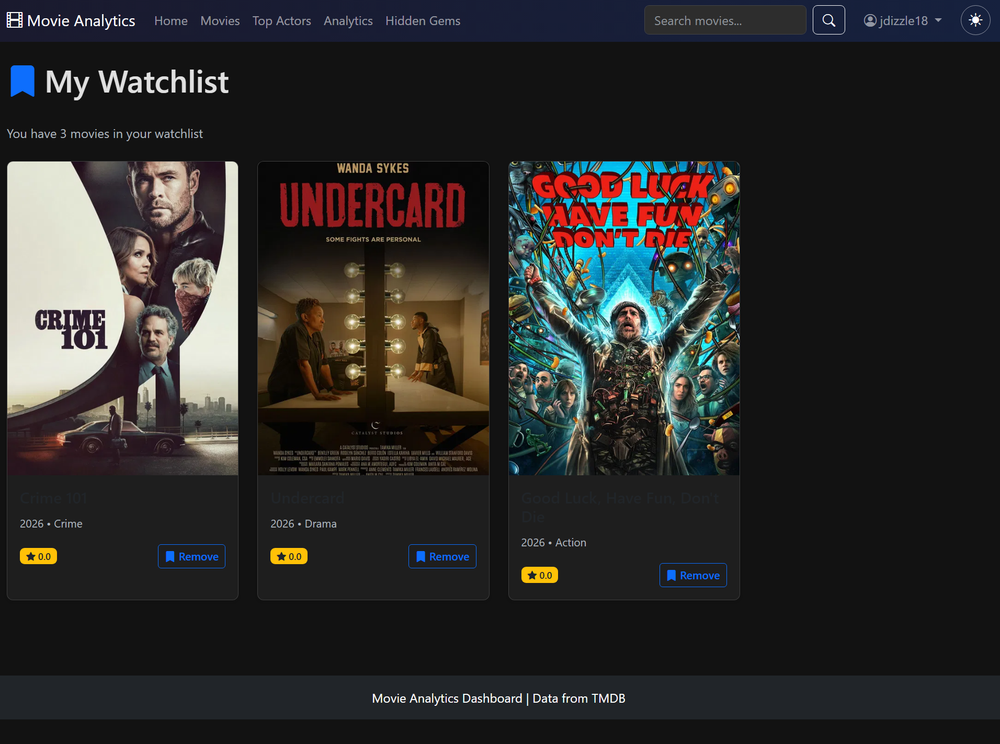
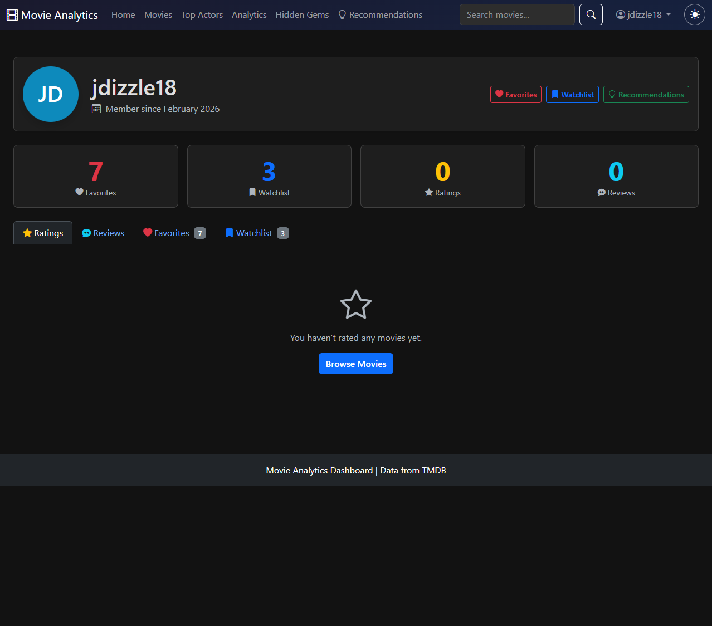
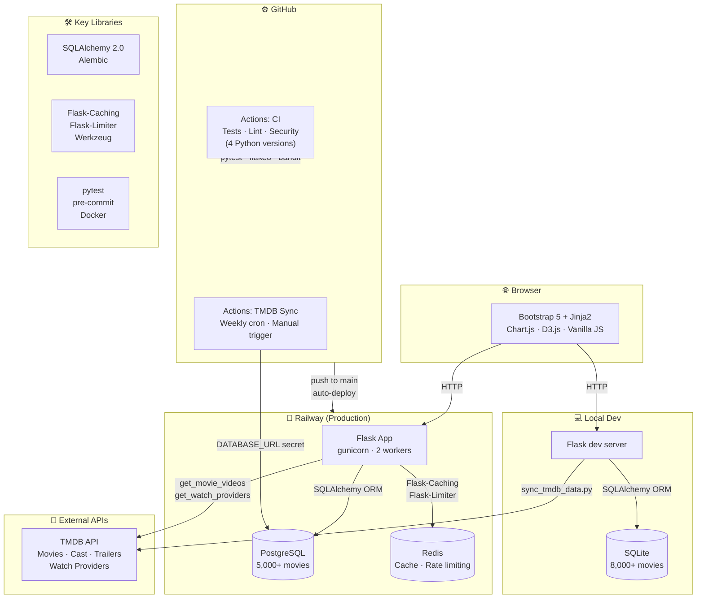

# 🎬 Movie Analytics Dashboard

> A full-stack movie discovery platform with user authentication, personalized collections, and comprehensive analytics — built to showcase modern web development skills.


<!-- Add this once deployed -->
📺 **[Live Demo](https://movie-analytics-dashboard-production.up.railway.app)**



## 🚀 Quick Start

```bash
# Clone and setup
git clone https://github.com/jaime-builds/movie-analytics-dashboard.git
cd movie-analytics-dashboard
python -m venv venv && source venv/bin/activate  # or .\venv\Scripts\activate on Windows

# Install and configure
pip install -r requirements.txt
echo "TMDB_API_KEY=your_key_here" > config/.env
echo "SECRET_KEY=your_secret_here" >> config/.env

# Initialize and run
python -m src.models  # Create database
python scripts/sync_tmdb_data.py --limit 1000  # Quick initial data (5 min)
python -m src.app  # Start server at http://127.0.0.1:5000
```

Get your [TMDB API key here](https://www.themoviedb.org/settings/api) (free, takes 2 minutes).

## 💡 What Makes This Special

This isn't just another movie app. It's a **portfolio-grade full-stack application** that demonstrates:

### 🎯 Core Features

| Feature | Description |
|---------|-------------|
| 🔐 **Authentication** | Secure login/registration with password hashing |
| 💖 **Personalization** | Favorites & watchlist collections per user |
| ⭐ **Ratings & Reviews** | 1-5 star ratings and text reviews for movies |
| 🎯 **Recommendations** | Personalized suggestions based on your favorites |
| 🎬 **Director Spotlight** | Explore 300+ directors with complete filmographies |
| 🏢 **Studios** | Browse production companies with filmographies and box office stats |
| 🗓️ **Decade Overview** | Curated pages per decade with defining films, top rated, genre breakdown |
| 🗂️ **Movie Collections** | Create and manage named lists of your favorite movies |
| 📊 **Analytics Dashboard** | Interactive Chart.js visualizations including budget/revenue scatter and profitability charts |
| 🔄 **Auto-Sync** | Automated daily updates from TMDB (10,000+ movies) |
| 🎭 **Actor Profiles** | Top actors with photos and filmography |
| 💎 **Hidden Gems** | Smart algorithm discovers underrated films |
| 🌙 **Dark Mode** | Full theme support with localStorage |
| 📱 **Mobile Responsive** | Optimized layouts for all screen sizes |
| 🔌 **RESTful API** | JSON endpoints for movies, analytics, actors, and collections |
| 👤 **User Profile** | Activity dashboard with ratings, reviews, favorites, watchlist, and collections |
| ⚡ **Infinite Scroll** | Seamless movie browsing without pagination |
| 🔍 **Search Autocomplete** | Live dropdown with poster thumbnails and keyboard navigation |
| ⚖️ **Movie Comparison** | Select up to 4 movies for side-by-side stats and visual charts |
| 🚀 **Query Caching** | Flask-Caching on analytics and genre routes for faster responses |
| 🎛️ **Advanced Filters** | Min vote count and status filters with collapsible panel |
| 🏠 **Home Page Hero** | Two-column hero with live stats bar, jaime-builds branding, and feature shortcut cards |
| 📤 **CSV Export** | Download full analytics data as a CSV file |
| 🚦 **Rate Limiting** | Flask-Limiter protecting all API and analytics endpoints |
| 📋 **Structured Logging** | JSON request logging with daily rotation, failed login tracking, and error alerting |
| 🐳 **Docker** | Dockerfile + docker-compose with volume mounts and health check |

### 🎨 User Experience

<div align="center">

| Favorites Collection | Watchlist Tracking | User Profile |
|:-------------------:|:-----------------:|:-----------:|
|  |  |  |

</div>

**Personal movie collections** that persist across sessions, beautifully designed with responsive grid layouts. The **User Profile** page provides a full activity dashboard — ratings, reviews, favorites, and watchlist all in one tabbed view.

## 🛠️ Technical Highlights

### Architecture & Design Patterns


```mermaid
flowchart TB
    subgraph Client["🌐 Browser"]
        UI["Bootstrap 5 + Jinja2\nChart.js · D3.js · Vanilla JS"]
    end

    subgraph GH["⚙️ GitHub"]
        direction LR
        CI["Actions: CI\nTests · Lint · Security\n(4 Python versions)"]
        SYNC["Actions: TMDB Sync\nWeekly cron · Manual trigger"]
    end

    subgraph Railway["🚂 Railway (Production)"]
        direction TB
        APP["Flask App\ngunicorn · 2 workers"]
        PG[("PostgreSQL\n5,000+ movies")]
        REDIS[("Redis\nCache · Rate limiting")]
        APP -- SQLAlchemy ORM --> PG
        APP -- Flask-Caching\nFlask-Limiter --> REDIS
    end

    subgraph Local["💻 Local Dev"]
        direction TB
        FLASK["Flask dev server"]
        SQLITE[("SQLite\n8,000+ movies")]
        FLASK -- SQLAlchemy ORM --> SQLITE
    end

    subgraph External["🔌 External APIs"]
        TMDB["TMDB API\nMovies · Cast · Trailers\nWatch Providers"]
    end

    UI -- HTTP --> APP
    UI -- HTTP --> FLASK
    APP -- get_movie_videos\nget_watch_providers --> TMDB
    FLASK -- sync_tmdb_data.py --> TMDB
    GH -- push to main\nauto-deploy --> Railway
    SYNC -- DATABASE_URL secret --> PG
    CI -- pytest · flake8 · bandit --> GH

    subgraph Stack["🛠️ Key Libraries"]
        direction LR
        S1["SQLAlchemy 2.0\nAlembic"]
        S2["Flask-Caching\nFlask-Limiter\nWerkzeug"]
        S3["pytest\npre-commit\nDocker"]
    end
```

### RESTful API

**Available Endpoints**

```bash
# Movies
GET  /api/v1/movies              # List movies (pagination, filtering, sorting)
GET  /api/v1/movies/<id>         # Movie details with cast/crew
GET  /api/v1/movies/search       # Search movies by title

# Analytics
GET  /api/v1/analytics/overview  # Total movies, avg rating, revenue
GET  /api/v1/analytics/genres    # Genre statistics
GET  /api/v1/analytics/top-movies # Top by rating/revenue/popularity

# Actors
GET  /api/v1/actors              # List actors with pagination
GET  /api/v1/actors/<id>         # Actor details with filmography

# System
GET  /api/v1/genres              # All genres
GET  /api/v1/health              # Health check
GET  /api/v1/docs                # API documentation
GET  /api/v1/collections         # User's collections (authenticated)
```

**Example Usage**

```bash
# Get top rated movies
curl http://localhost:5000/api/v1/movies?sort=rating&per_page=10

# Search movies
curl http://localhost:5000/api/v1/movies/search?q=inception

# Get analytics
curl http://localhost:5000/api/v1/analytics/overview
```

### Advanced SQL Showcase

This project demonstrates **professional-grade SQL** including:

**Complex Joins & Aggregations**

```sql
-- Top actors with statistics
SELECT p.name, COUNT(c.movie_id) as movies, AVG(m.vote_average) as avg_rating
FROM people p
JOIN cast c ON p.id = c.person_id
JOIN movies m ON c.movie_id = m.id
WHERE m.vote_count > 20
GROUP BY p.id HAVING COUNT(c.movie_id) >= 2
ORDER BY movies DESC;
```

**Subqueries & Window Functions**

```sql
-- Similar movies using genre matching
SELECT m.*, COUNT(mg.genre_id) as genre_matches
FROM movies m
JOIN movie_genres mg ON m.id = mg.movie_id
WHERE mg.genre_id IN (SELECT genre_id FROM movie_genres WHERE movie_id = ?)
GROUP BY m.id
ORDER BY genre_matches DESC, m.vote_average DESC;
```

**Custom Algorithms**

```sql
-- Hidden gems formula: high rating, low popularity
SELECT * FROM movies
WHERE vote_average >= 7.0 AND popularity <= 20.0 AND vote_count >= 50
ORDER BY (vote_average / LOG(popularity + 2)) DESC;
```

### Tech Stack

**Backend**

- Python 3.11+ with Flask
- SQLAlchemy ORM
- Flask-Caching (SimpleCache) for query result caching
- Flask-Limiter for API rate limiting
- Structured JSON logging with daily rotation (logs/app.log)
- Werkzeug password hashing
- Schedule for automation
- pytest for testing

**Frontend**

- Bootstrap 5 (responsive design)
- Chart.js (data visualization)
- Vanilla JavaScript (DOM manipulation, infinite scroll, toast notifications)
- Jinja2 templating
- Native lazy loading (`loading="lazy"`)

**Database**

- SQLite (development)
- PostgreSQL-ready (production)
- Normalized schema with 14 tables
- Many-to-many relationships
- Compound indexes

**DevOps**

- Docker (Dockerfile + docker-compose with volume mounts and health check)
- Automated TMDB sync (daily)
- Structured JSON logging
- GitHub Actions CI/CD
- Environment-based config

## 📊 Project Stats

- **8,000+** movies with complete metadata (local) | **5,000+** on live Railway instance
- **300+** directors with filmographies
- **1,000+** actors with profiles
- **87%** test coverage with 339 tests passing
- **15** database tables with optimized indexes
- **35+** Flask routes
- **13** RESTful API endpoints
- **28+** Jinja2 templates

## 🎓 Skills Demonstrated

### Full-Stack Development

✅ Flask web framework & routing
✅ SQLAlchemy ORM with complex queries
✅ RESTful API design & implementation
✅ Session management & authentication
✅ Template inheritance & Jinja2
✅ Responsive UI with Bootstrap
✅ Mobile-first design principles

### Database & SQL

✅ Schema design & normalization
✅ Complex JOINs & subqueries
✅ Aggregations & window functions
✅ Query optimization & indexing
✅ Many-to-many relationships
✅ Data modeling best practices

### Python & Best Practices

✅ Object-oriented programming
✅ API integration (TMDB)
✅ Error handling & logging
✅ Virtual environments
✅ Automated testing (unittest/pytest)
✅ Background job scheduling

### DevOps & Tools

✅ Git version control
✅ Docker containerization
✅ Environment configuration
✅ Automated data pipelines
✅ CI/CD with GitHub Actions
✅ Structured logging
✅ Comprehensive documentation
✅ Production deployment (Railway)
✅ PostgreSQL in production
✅ Database migrations (Alembic)

## 📚 Detailed Documentation

<details>
<summary><b>📖 Full Installation Guide</b></summary>

### Prerequisites

- Python 3.8+
- pip package manager
- Git
- TMDB API key ([get free key](https://www.themoviedb.org/settings/api))

### Step-by-Step Setup

1. **Clone repository**

   ```bash
   git clone https://github.com/jaime-builds/movie-analytics-dashboard.git
   cd movie-analytics-dashboard
   ```

2. **Create virtual environment**

   ```bash
   python -m venv venv

   # Windows
   .\venv\Scripts\activate

   # macOS/Linux
   source venv/bin/activate
   ```

3. **Install dependencies**

   ```bash
   pip install -r requirements.txt
   ```

4. **Configure environment**

   Create `config/.env`:

   ```env
   TMDB_API_KEY=your_api_key_here
   DATABASE_URL=sqlite:///movies.db
   SECRET_KEY=your_secret_key_here
   ```

5. **Initialize database**

   ```bash
   python -m src.models
   ```

6. **Import movie data**

   ```bash
   # Quick start (1,000 movies, ~5 minutes)
   python scripts/sync_tmdb_data.py --limit 1000

   # Full dataset (5,000 movies, ~30 minutes)
   python scripts/sync_tmdb_data.py --limit 5000
   ```

7. **Run application**

   ```bash
   python -m src.app
   ```

   Visit: <http://127.0.0.1:5000>

8. **Optional: Enable auto-sync**

   ```bash
   python scripts/scheduler.py
   ```

</details>

<details>
<summary><b>🗂️ Database Schema</b></summary>

### Tables

**Core Tables**

- `movies` - 10,000+ films with metadata, ratings, financial data
- `genres` - 19 movie genres
- `people` - Actors, directors, crew (with profile images)
- `production_companies` - Studios and production companies

**Relationships**

- `movie_genres` - Many-to-many (movies ↔ genres)
- `movie_companies` - Many-to-many (movies ↔ companies)
- `cast` - Movie cast with character names
- `crew` - Movie crew with job titles

**User System**

- `users` - Authentication with hashed passwords
- `user_favorites` - Many-to-many (users ↔ favorite movies)
- `user_watchlist` - Many-to-many (users ↔ watchlist movies)
- `ratings` - User ratings (1-5 stars) for movies
- `reviews` - User text reviews for movies
- `collections` - User-created named movie lists
- `collection_movies` - Many-to-many (collections ↔ movies)

### ER Diagram

```text
users ─┬─< user_favorites >─┬─ movies ─┬─< movie_genres >─┬─ genres
       │                     │          │                   │
       ├─< user_watchlist >──┤          ├─< movie_companies >─ production_companies
       │                     │          │
       ├─< ratings >─────────┤          ├─< cast >──── people
       │                     │          │
       └─< reviews >─────────┘          └─< crew >──── people
```

</details>

<details>
<summary><b>🧪 Testing</b></summary>

### Run Tests

```bash
# Run with pytest
pytest

# With coverage
pytest --cov=src --cov-report=html

# Specific test file
pytest tests/test_auth.py -v
```

### Test Coverage

- ✅ User authentication (registration, login, logout)
- ✅ Password validation
- ✅ Favorites add/remove
- ✅ Watchlist add/remove
- ✅ Ratings submit/update
- ✅ Reviews create/delete
- ✅ Session management
- ✅ Database relationships
- ✅ Security (password hashing)

**Current Coverage**: 87% (339 tests passing)

### Run Tests

```bash
# Convenience wrapper (recommended)
python run_tests.py

# Direct pytest
pytest

# With coverage
pytest --cov=src --cov-report=html

# Specific test file
pytest tests/test_auth.py -v
```

</details>

<details>
<summary><b>🔄 Data Synchronization</b></summary>

### Manual Sync

```bash
# Sync 5000 movies
python scripts/sync_tmdb_data.py --limit 5000

# Update existing movies
python scripts/sync_tmdb_data.py --limit 5000 --update-existing

# Update only recent changes (last 7 days)
python scripts/sync_tmdb_data.py --recent-only --days 7
```

### Automated Sync

The scheduler runs:

- **Daily full sync** at 2:00 AM (5,000 movies)
- **Hourly updates** for recently modified movies

```bash
# Start scheduler
python scripts/scheduler.py

# Run as background service
nohup python scripts/scheduler.py &
```

### What Gets Synced

- ✅ Movie metadata (title, overview, release date)
- ✅ Ratings and popularity
- ✅ Cast and crew (top 10 actors)
- ✅ Director information
- ✅ Production companies
- ✅ Genres
- ✅ Poster and backdrop images
- ✅ Actor profile photos

</details>

<details>
<summary><b>🎨 Features Deep Dive</b></summary>

### Ratings & Reviews System

- **Star Ratings**: 1-5 stars per movie
- **Text Reviews**: Write detailed reviews (minimum 10 characters)
- **Edit/Delete**: Manage your own reviews
- **Average Ratings**: See community ratings
- **Pagination**: Browse all reviews efficiently

### Personalized Recommendations

Algorithm uses:

- User's favorite movies
- Genre preferences extraction
- Weighted genre matching
- Popularity and rating scores

```python
# Recommendation formula
matches = count_shared_genres(user_favorites, candidate_movie)
score = matches * vote_average * log(popularity)
```

### Director Spotlight

- Browse 300+ directors
- Complete filmographies with statistics
- Career timeline charts (ratings over time, box office)
- Genre distribution analysis
- Grid and list view options
- Filter by movie count

### Hidden Gems Algorithm

```python
gem_score = vote_average / (log(popularity + 2) * 2)
```

Finds high-quality, underappreciated films by balancing:

- High rating (≥7.0)
- Low popularity (≤20.0)
- Sufficient votes (≥50)

### Analytics Dashboard

- **Genre Distribution** - Pie chart
- **Release Timeline** - Bar chart by year
- **Ratings by Genre** - Horizontal bar chart
- **Budget vs Revenue Scatter** - Each movie plotted with a break-even reference line and ROI tooltips
- **Most Profitable Movies** - Horizontal bar chart of top 15 films by net profit
- **Top Studios** - Production company rankings

All charts are:

- Interactive (hover for details)
- Responsive (mobile-friendly)
- Dark mode compatible

### User Profile Page

A dedicated activity hub showing:

- **Stats row** — favorites count, watchlist count, ratings count, reviews count, and personal average rating
- **Ratings tab** — all movies rated with star display and timestamps
- **Reviews tab** — all written reviews with links back to each movie
- **Favorites tab** — full poster grid of favorited movies
- **Watchlist tab** — full poster grid of watchlisted movies

### RESTful API

11 endpoints providing:

- Movie search and filtering
- Analytics and statistics
- Actor/director information
- System health monitoring
- Complete API documentation at `/api/v1/docs`

</details>

## 🚀 Future Roadmap

See [TODO.md](TODO.md) for the complete roadmap.

### Recently Shipped

- [x] **Responsive image optimization** - srcset on all poster grids (w185/w342/w500); Jinja2 macro for reuse
- [x] **Advanced search** - Dedicated `/advanced-search` with genre, era, rating, runtime filters; active filter pills
- [x] **Actor collaboration network** - D3.js force graph at `/actor/<id>/network`; photo nodes, weighted edges, shared film tooltips
- [x] **Streaming availability** - Where to Watch card on movie detail; stream/rent/buy via TMDB/JustWatch
- [x] **Collection pagination** - 24 movies per page with page counter
- [x] **Weekly TMDB sync** - GitHub Actions cron job; 5,000 movies; manual trigger available
- [x] **Architecture diagram** - Mermaid flowchart in README covering full stack
- [x] **PostgreSQL registration fix** - Alembic migration 002 expands password_hash to String(256)
- [x] Error logging and monitoring (JSON structured, daily rotation)
- [x] Docker containerization (Dockerfile + docker-compose)
- [x] Restored run_tests.py as pytest convenience wrapper
- [x] Production companies (Studios) page with detail pages
- [x] Decade overview pages with defining films and charts
- [x] Movie collections (user-created named lists)
- [x] Navbar reorganized into Explore and Discover dropdowns
- [x] Search autocomplete with keyboard navigation
- [x] Query caching with Flask-Caching (1-hour TTL)
- [x] Movie comparison tool (up to 4 movies, `/compare` page)
- [x] **Railway deployment** - Live at https://movie-analytics-dashboard-production.up.railway.app
- [x] **PostgreSQL** - Migrated from SQLite; dual-database compatible
- [x] **Alembic migrations** - Full schema versioning with baseline migration
- [x] **CI/CD auto-deploy** - Push to main triggers Railway deployment
- [x] **Test suite unified** - All tests run in single pytest pass; 339 passing

### Up Next

See [TODO.md](TODO.md) for the full roadmap.

## 📝 License

This project is open source and available under the [MIT License](LICENSE).

## 🤝 Contributing

Contributions, issues, and feature requests are welcome!

1. Fork the project
2. Create your feature branch (`git checkout -b feature/AmazingFeature`)
3. Commit your changes (`git commit -m 'Add some AmazingFeature'`)
4. Push to the branch (`git push origin feature/AmazingFeature`)
5. Open a Pull Request

## 📬 Contact

**Jaime De La Paz**

[](https://github.com/jaime-builds)
[](https://www.linkedin.com/in/jaimedelapaz)

⭐ **Star this repo** if you found it helpful!

## 🙏 Acknowledgments

- [The Movie Database (TMDB)](https://www.themoviedb.org/) for movie data
- [Bootstrap](https://getbootstrap.com/) for UI components
- [Chart.js](https://www.chartjs.org/) for data visualization
- [UI Avatars](https://ui-avatars.com/) for generated profile images

<div align="center">

**Built with ❤️ as a portfolio project**

*Showcasing full-stack development with Python, Flask, SQL, and modern web technologies*

</div>
